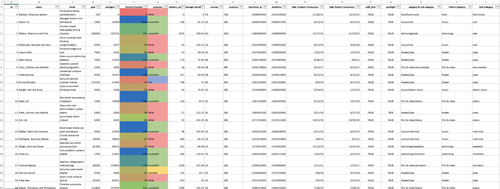
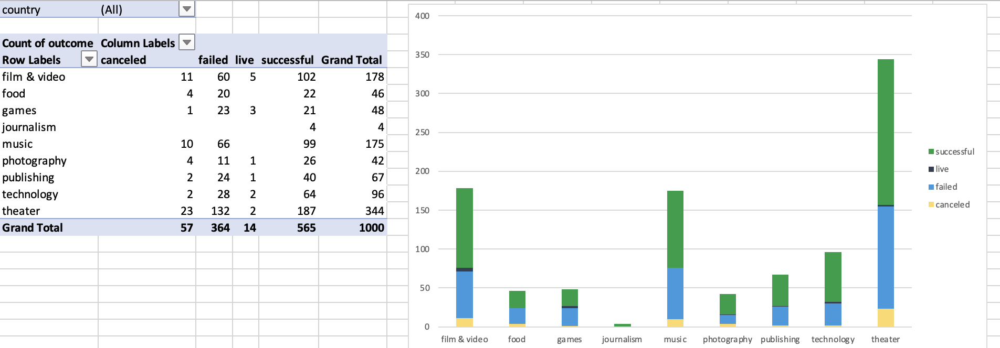
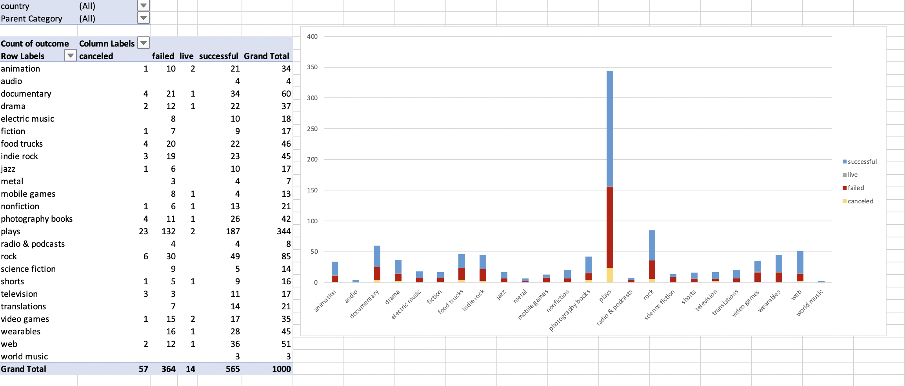
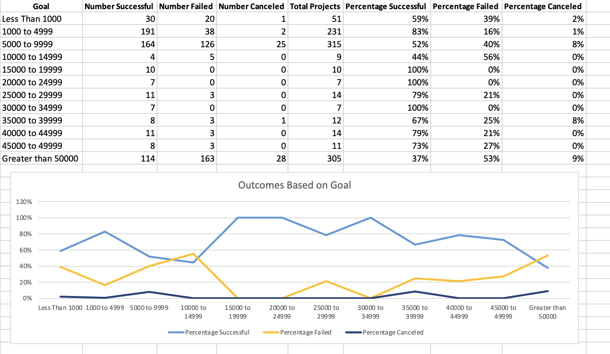

# Charting Crowdfunding Campaign

A database of 1,000 generated sample projects was organized, modified, and analyzed in an attempt to uncover hidden market trends to find success in meeting or exceeding the project’s initial goal in a crowdfunding campaign. 

*	The Percent Funded column was created to show how much money a campaign made relative to its initial goal.
*	The Average Donation column was created to uncover how much each project backer paid on average.
*	Two new columns, one called Parent Category and another called Sub-Category was created to split the Category and Sub-Category into separate columns.

*	New sheets with a pivot tables were created to analyze the initial worksheet to count how many campaigns were successful, failed, canceled, or are currently live per category and per sub-category. 

*	Stacked column pivot charts that can be filtered by country and country and parent-category based on the created tables were created.
*	The Date Created Conversion and Date Ended Conversion columns were created to convert the data contained within launched_at and deadline into Excel’s date format.

*	A new sheet with a pivot table with a column of state, rows of Date Created Conversion, values based on the count of state, and filters based on parent category and Years was created a long with a pivot chart line graph that visualizes it.

A new sheet was also created to reveal how many successful, failed, and canceled projects were created with goals by count and percentage. Also, a line chart that graphs the relationship between a goal amount and its chances of success, failure, or cancellation was created.

There are more successful crowdfunding campaigns than failed campaigns when the data is looked at as a whole/ total, which means that crowdfunding campaigns are successful generally/ overall. There are a total of 565 successful crowdfunding campaigns and 364 failed crowdfunding campaigns.

## Bonus Statistical Analysis

Most people would use the number of campaign backers to assess the success of a crowdfunding campaign. Creating a summary statistics table is one of the most efficient ways to characterize quantitative metrics, such as the number of campaign backers. Therefore, a summary statistics table was created to evaluate the number of backers of successful and unsuccessful campaigns.

The following were evaluated for successful and unsuccessful campaigns:
*	The mean number of backers
*	The median number of backers
*	The minimum number of backers
*	The maximum number of backers
*	The variance of the number of backers
*	The standard deviation of the number of backers

Median summarizes the data more meaningfully since it isn’t influenced by extremely large values and because the mean can be distorted by outliers. Also, it looks like there is more variability with successful campaigns since it has a higher variance and standard deviation too. This makes sense since there are more data and outliers for successful campaigns than unsuccessful campaigns.
